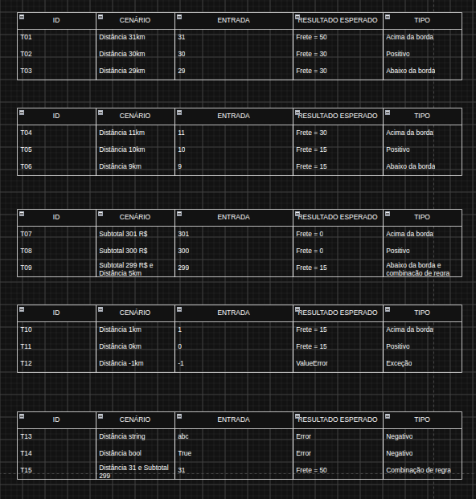

# TESTES E QUALIDADE DE SOFTWARE

Atividade da disciplina de Testes e Qualidade de Software (QA).

O trabalho consiste em criar testes unitários para um código fornecido pelo professor, aplicando todos os conceitos de testes unitários, como stub, mock, setUp, tearDown, planejamento dos testes, etc...

## Planejamento de Testes

Esses foram os teste planejados apenas para o método "calcular_frete" da classe Pedido.



## Rodando os Testes

Ao rodar os testes unitários com o comando:

```
python -m unittest tests.test_pedidos
```

Dará erro em 1 teste e fail em outro.

## Explicando os erros

Error: test_calcular_frete_distancia_string

Entrada: 'abc'

Resultado esperado: Exceção personalizada e amigável informando que o método não aceita str

Resultado obtido: Exceção padrão do python

O código não possui proteção contra tipagens diferentes de dados, assim causando erro ao comparar um str com um int. Uma possível solução seria levantar exceções caso isso acontecesse.
